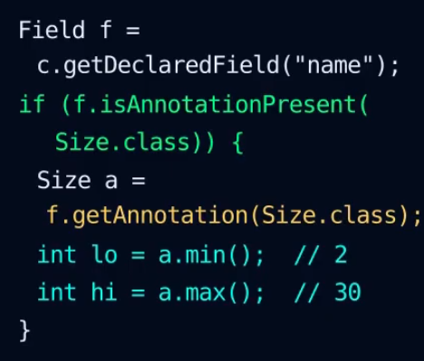
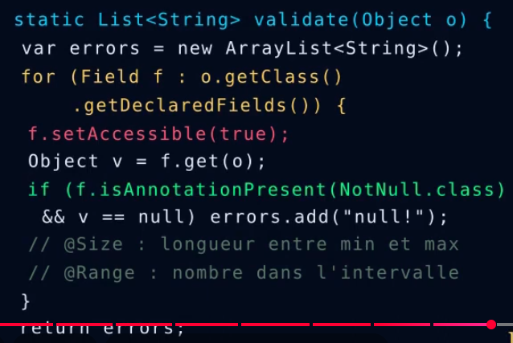

# Syntaxe
Pour créer le nom de l'annotation :
    
    public @interface NomAnnotation {}

Durée de vie :

    @Retention(RetentionPolicy.RUNTIME)
    --> visible par la reflexion (obligatoire pour framework)

Emplacements permises :

    @Target 
        - TYPE : interface, classes
        - METHOD / FIELD / PARAMETER : fonctions / champs / paramètres
        - CONSTRUCTOR : constructeur
        - plusieurs : tableau {...}
        - sans : presque partout
        - @Documented : vue dans les javadoc
        - @Inherited : héritée par les classes filles

Annotations paramétrables :
    
    public @interface Size {
        int min() default 0;
        int max() default 100;
    }

    @Size(min = 2, max = 30)
    private String name;

    - Autorisées :
        - sans paramètre
        - Types primitifs
        - String, enum, Class, tableaux
        - default --> attribut optionnel
        - value seul : @Size(10)

Lire l'annotation par reflexion :

Ajout d'un moteur de validation :

